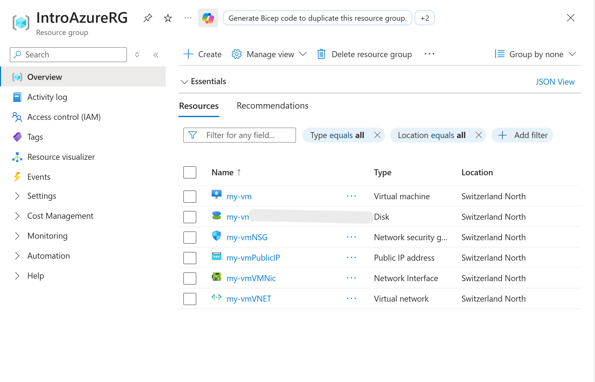

# Step-by-Step Implementation

## Created a Resource Group

1. Logged into the Azure Portal.
2. Opened **Azure Cloud Shell** and selected **Azure CLI**.
3. Created a new resource group using the command:

```bash
az group create --name IntroAzureRG --location switzerlandnorth
```
This resource group is used to logically group and manage all VM-related resources.



## Created a Linux Virtual Machine

1. From Cloud Shell, I executed the following command to create a Linux VM:
```bash
az vm create \
  --resource-group "IntroAzureRG" \
  --name my-vm \
  --size Standard_D2s_v3 \
  --public-ip-sku Standard \
  --image Ubuntu2204 \
  --admin-username azureuser \
  --generate-ssh-keys
```

2. Azure automatically provisioned:
   
  - Virtual Machine
  - Public IP address
  - Network Interface
  - Virtual Network
  - Network Security Group
  - OS Disk
3. SSH keys were generated automatically for secure access.

## Installed Nginx Using Custom Script Extension

1. Used the Azure VM Custom Script Extension to install and configure Nginx:
```bash
az vm extension set \
  --resource-group "IntroAzureRG" \
  --vm-name my-vm \
  --name customScript \
  --publisher Microsoft.Azure.Extensions \
  --version 2.1 \
  --settings '{"fileUris":["https://raw.githubusercontent.com/MicrosoftDocs/mslearn-welcome-to-azure/master/configure-nginx.sh"]}' \
  --protected-settings '{"commandToExecute": "./configure-nginx.sh"}'
```
2. The script performed the following actions:

   - Updated package lists using apt-get update
   - Installed Nginx
   - Modified the default web page to display a welcome message including the VM hostname

## Lessons Learned

- Azure CLI enables fast, repeatable infrastructure creation.
- VM extensions simplify post-deployment configuration.

