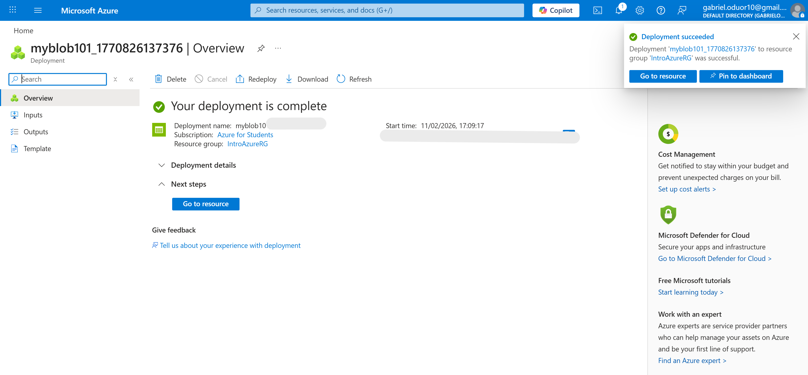
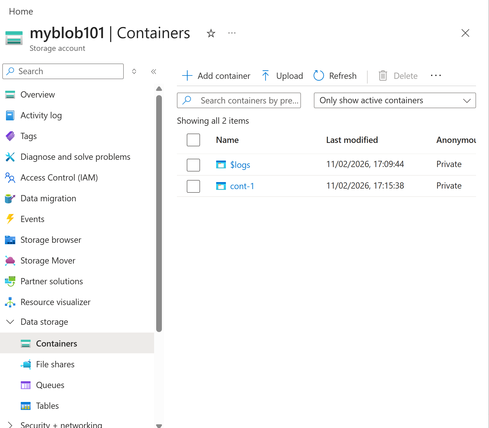
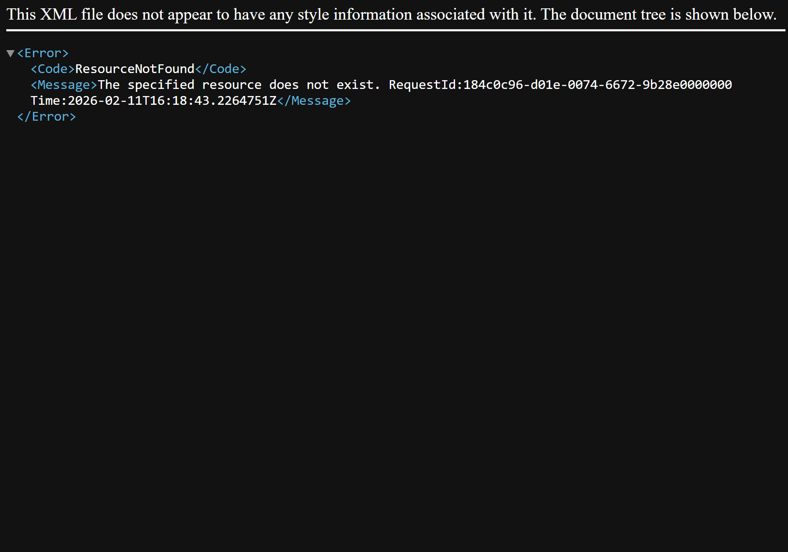
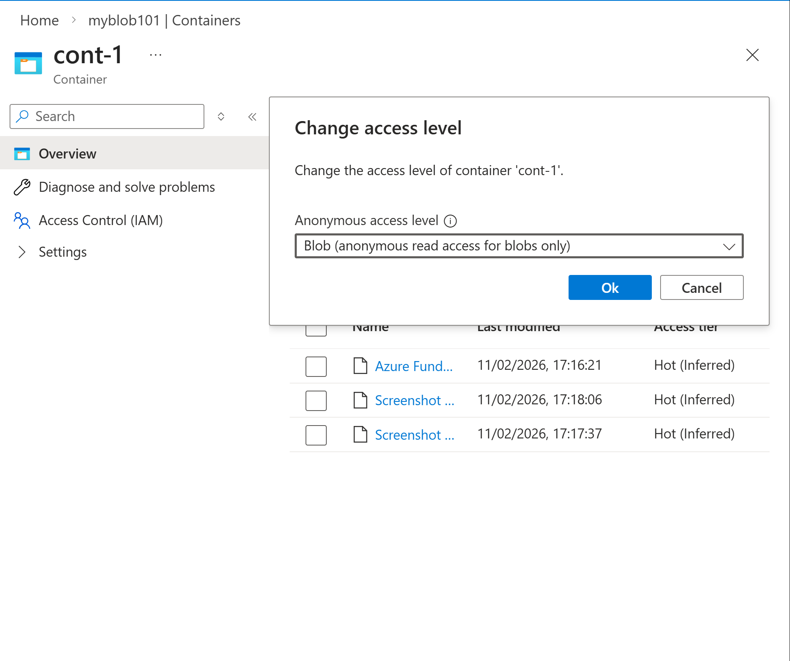
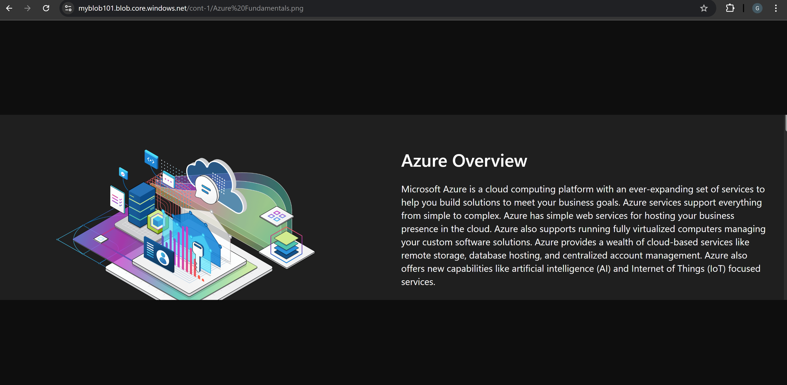

# Step-by-Step Implementation

## 1: Create a Storage Account

1. Signed in to the Azure Portal.
2. Navigated to:
   - Create a resource → Infrastructure Services → Storage account
3. Configured the following settings:

- Resource Group: IntroAzureRG
- Storage Account Name: (globally unique name)
- Performance: Standard
- Redundancy: Locally Redundant Storage (LRS)
- Allow anonymous access on individual containers: Enabled

4. Reviewed and created the storage account.
5. Navigated to the newly created storage account.

---

## 2: Create a Blob Container

1. Under **Data Storage**, selected **Containers**.
2. Clicked **+ Add container**.
3. Configured:
   - Name: (container name)
   - Anonymous access level: Private (no anonymous access)
4. Created the container.

---

## 3: Upload a Blob

1. Opened the container.
2. Selected **Upload**.
3. Uploaded an image file.
4. After upload, selected the blob and copied the **Blob URL**.
5. Opened the URL in a new browser tab.

Result:
- Received an error indicating the resource could not be accessed.
- This confirmed the container was private.

---

## 4: Change Access Level

1. Returned to the container settings.
2. Selected **Change access level**.
3. Set access level to:
   - Blob (anonymous read access for blobs only)
4. Saved the changes.
5. Refreshed the browser tab with the blob URL.

Result:
- The image was now publicly accessible.

---

## Cleanup

Deleted the resource group to remove all associated resources:

1. Navigated to Resource Groups.
2. Selected IntroAzureRG.
3. Deleted the resource group.

---

## Lessons Learned

- Azure Storage Accounts are globally unique.
- Blob containers are private by default.
- Access levels determine internet visibility.
- LRS provides local redundancy within a region.
- Public blob access must be explicitly enabled.

