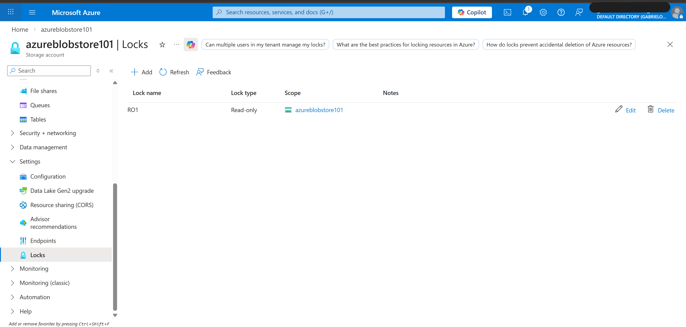
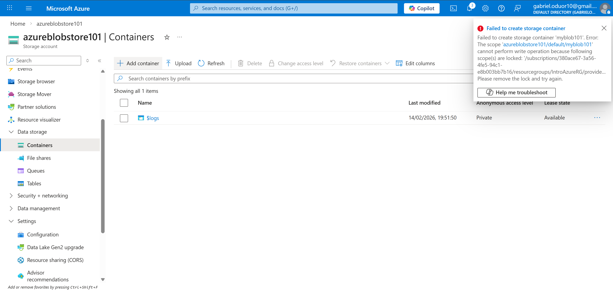
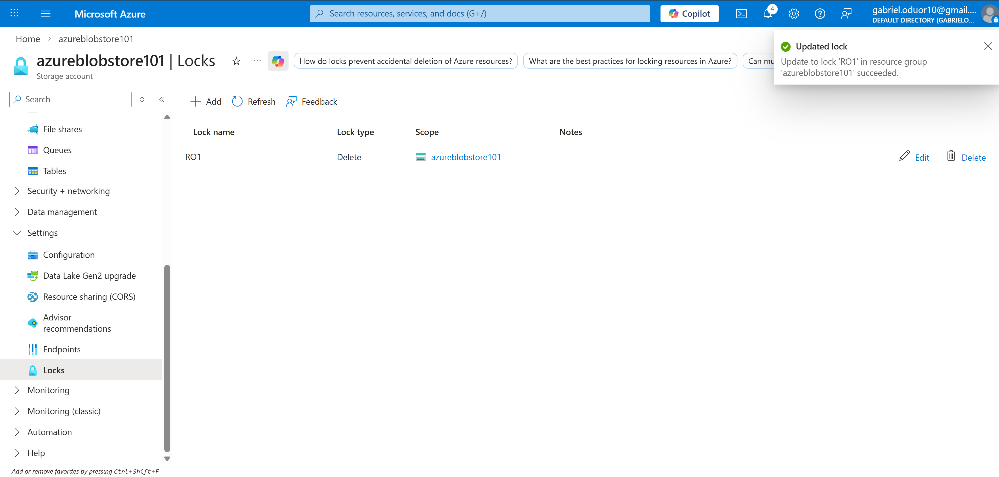
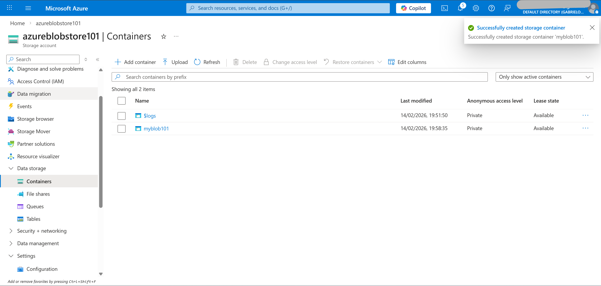
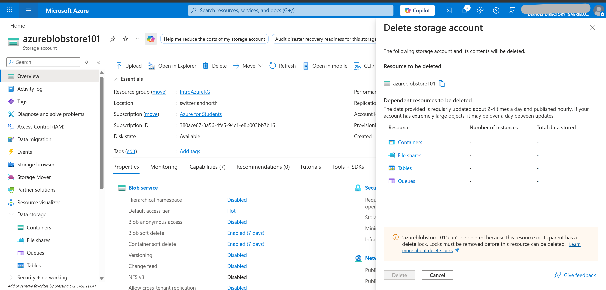
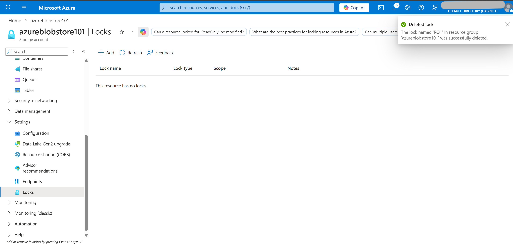
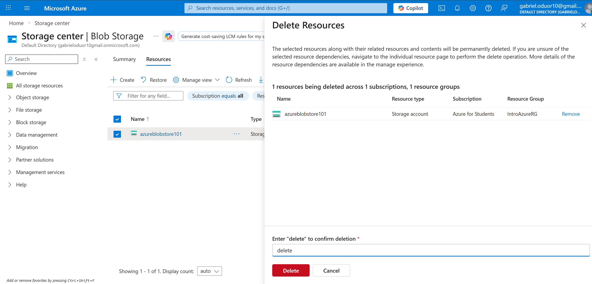
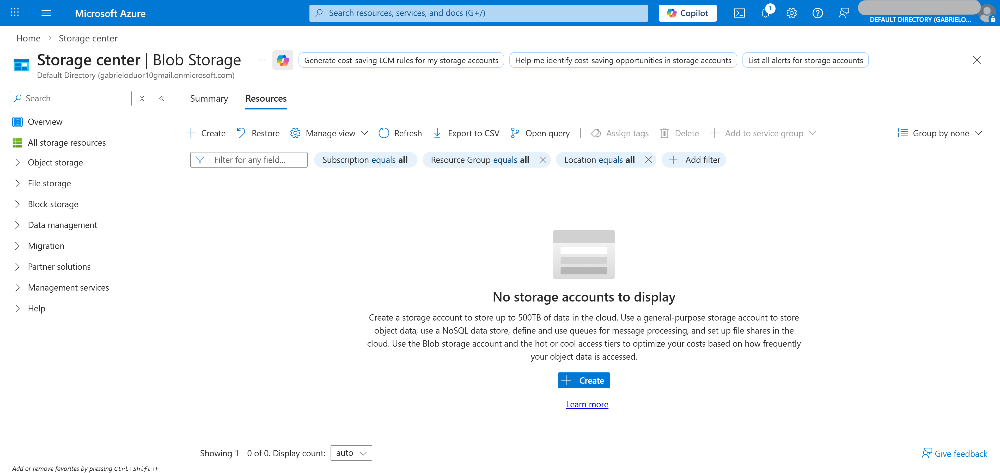

# Technical Implementation – Azure Resource Locks

---

## 1 – Create Resource Group

1. Log into Azure Portal
2. Navigate to Resource Groups
3. Select Create
4. Configure:
   - Name: IntroAzureRG
   - Region: Your preferred region; e.g Central US
5. Click Create

Purpose:
Provides a logical boundary for managing and cleaning up deployed resources.

---

## 2 – Create Storage Account

1. Select Create a Resource
2. Choose Storage Account
3. Configure:
   - Resource Group: IntroAzureRG
   - Storage account name:	Enter a unique storage account name
   - Performance: Standard
   - Redundancy: Locally Redundant Storage (LRS)
4. Click Review + Create
5. Click Create
6. Go to Resource

---

## 3 – Apply Read-Only Lock

1. Navigate to Storage Account
2. Select Locks (under Settings)
3. Click + Add
4. Configure:
   - Lock Name: choose a Lock name
   - Lock Type: Read-only
5. Click OK

Expected Behavior:
All write operations on the resource are blocked.

---

## 4 – Attempt to Create Container

1. Navigate to Containers (under Data Storage)
2. Click + Container
3. Enter container name
4. Click Create

Result:
Operation fails.

Reason:
Read-only lock prevents management-plane write operations.

---

## 5 – Modify Lock to Delete

1. Navigate to Locks
2. Select existing lock
3. Change Lock Type:
   Read-only → Delete
4. Click OK

Now:
- Container creation succeeds
- Configuration updates allowed
- Resource deletion blocked

---

## 6 – Attempt to Delete Storage Account

1. Navigate to Overview
2. Click Delete

Result:
Deletion fails due to active delete lock.

---

## 7 – Remove Lock and Delete Storage Account

1. Navigate to Locks
2. Delete the lock
3. Return to Overview
4. Select Delete
5. Confirm by entering "delete"
6. Complete deletion

---

---

## 8 – Cleanup Resource Group

1. Navigate to Resource Groups
2. Select IntroAzureRG
3. Click Delete Resource Group
4. Confirm deletion

All associated resources are removed.

---

## Engineering Observations

- Locks are enforced at the Azure Resource Manager (ARM) layer.
- Locks override RBAC permissions.
- Delete locks are commonly used in production environments.
- Proper cleanup prevents unnecessary cost accumulation.

