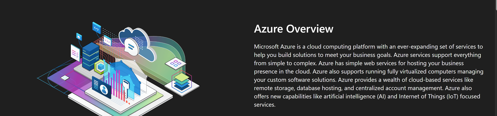

# Azure Fundamentals Learning Journey
This repository documents my hands-on leaning journey through Azure Fundamentals.
Each Folder represents a completed exercise or mini-project, including objectives, steps performed, and key learnings.

## Exercises Completed
- Creating an Azure Resource (Virtual Machine)
- More coming soon...

## Tools used
- Microsoft Azure Portal
- Github
